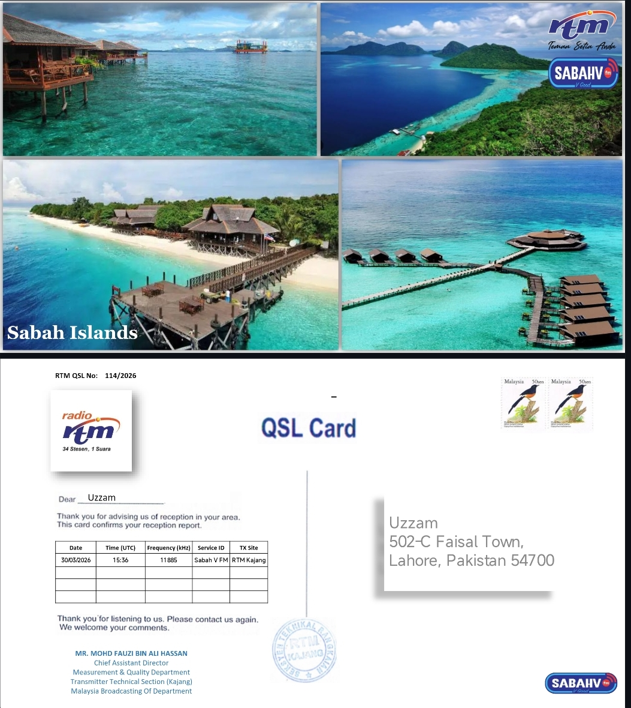
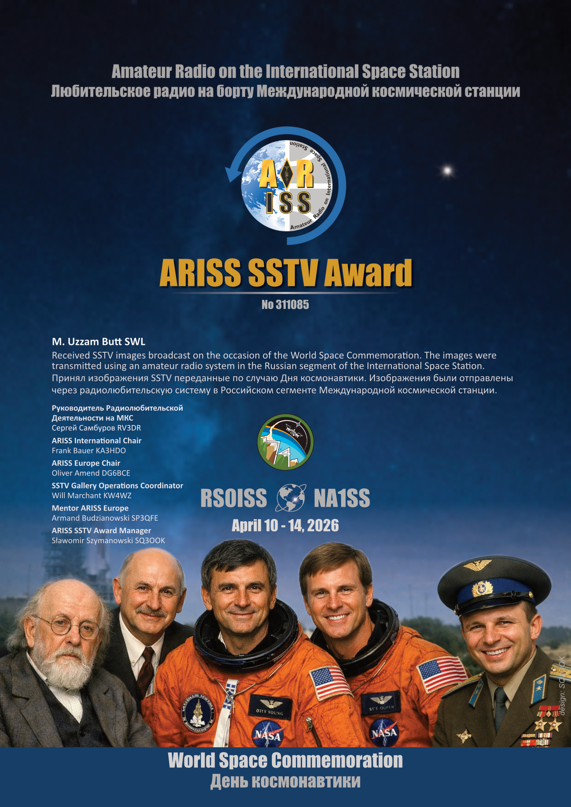
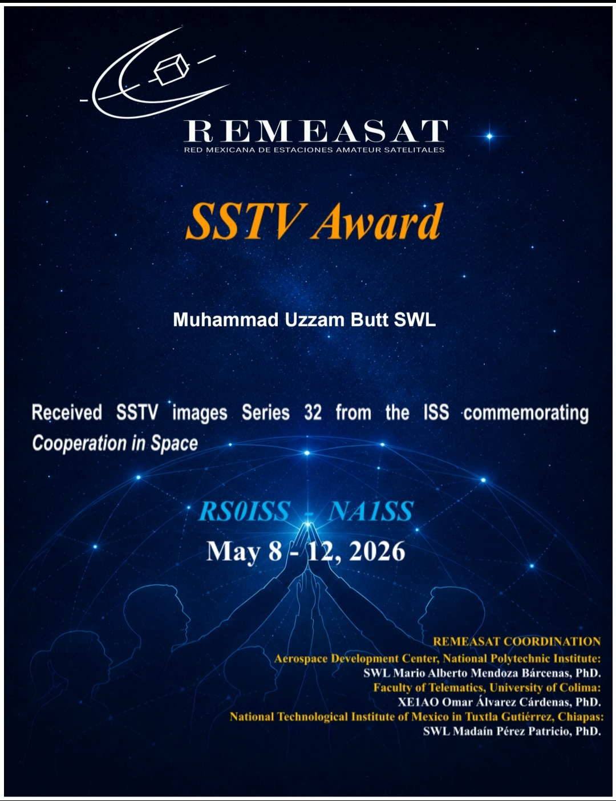

# QSL-Cards
Each and every Qsl I ever got will be listed here 

## QSL Card Gallery

| Card Name | Callsign | Date | Band/Mode | QSL Type | Card Image |
| --- | --- | --- | --- | --- | --- |
| RTM Kajang | - | 30/3/2026 | AM | eQSL |  |
| ARISS Series 31 | RS0ISS | 13/4/2026 | SSTV | Diploma |  |
| Remeasat Series 32 | RS0ISS | 8/5/2026 | SSTV | Diploma |  |
