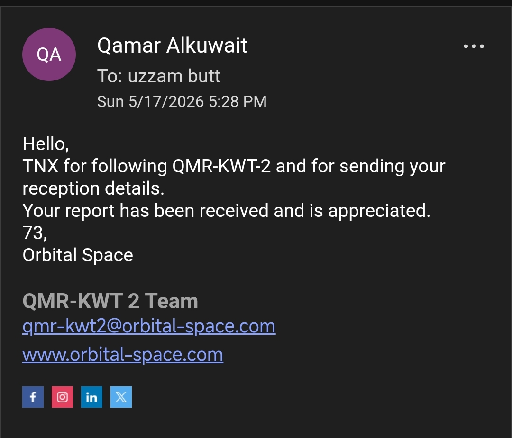
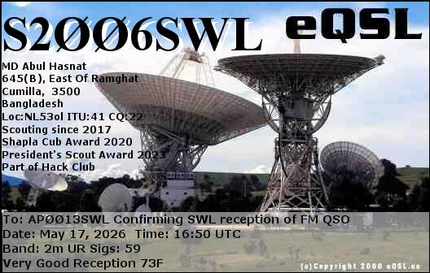
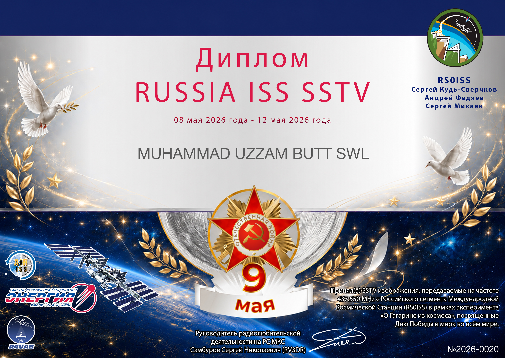
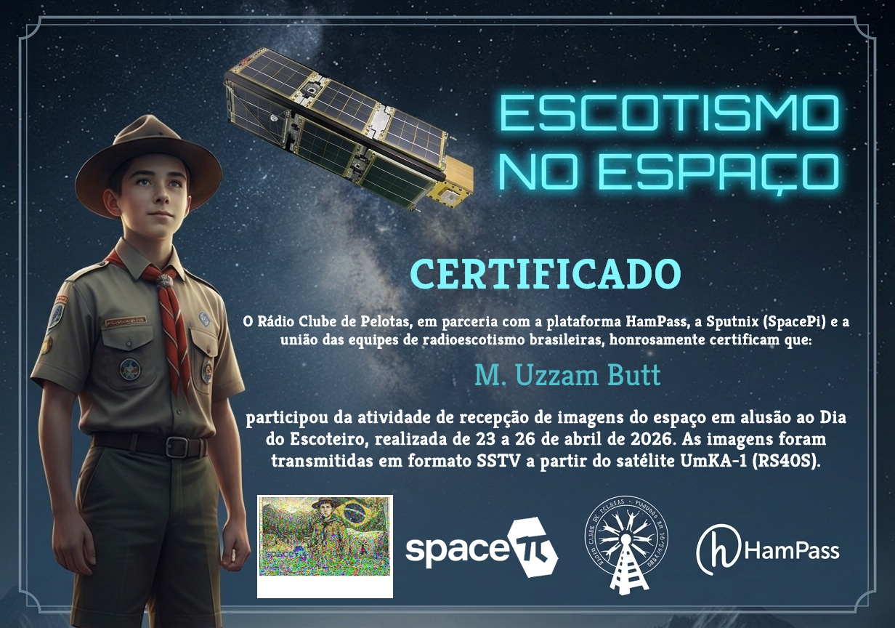

# QSL-Cards
Each and every Qsl I ever got will be listed here 
```
Name: Muhammad Uzzam Butt
Callsign: AP0013SWL
location: MM71dl
```
## QSL Card Gallery

| # | Card Name | Callsign | Date | Band / Mode | QSL Type | Preview |
| ---: | --- | --- | --- | --- | --- | --- |
| 1 | RTM Kajang | - | 2026-03-30 | AM | eQSL |  |
| 2 | ARISS Series 31 | RS0ISS | 2026-04-13 | SSTV | Diploma |  |
| 3 | Remeasat Series 32 | RS0ISS | 2026-05-08 | SSTV | Diploma |  |
| 4 | QMR-KWT-2 | RS59S | 2026-05-12 | 2400bd GMSK USP | E-Mail QSL |  |
| 5 | QSO  | S2006SWL | 2026-05-17 | FM Repeater | eQSL |  |
| 6 | R4uab ISS SSTV  | RS0ISS/NA0ISS | 2026-05-18 | SSTV Martin 32 | Diploma | |
| 7 | UmKA-1 Scouts Day | RS40S-1 | 2026-05-19 | SSTV | Diploma | |
